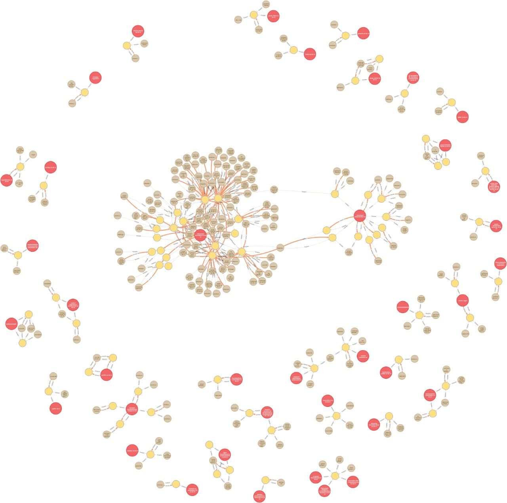
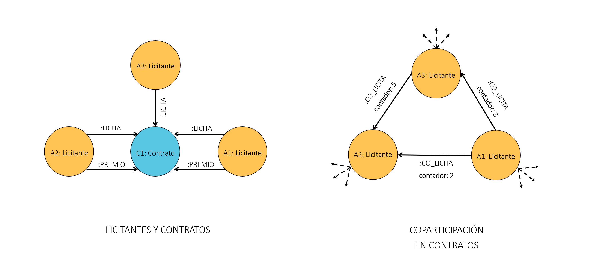
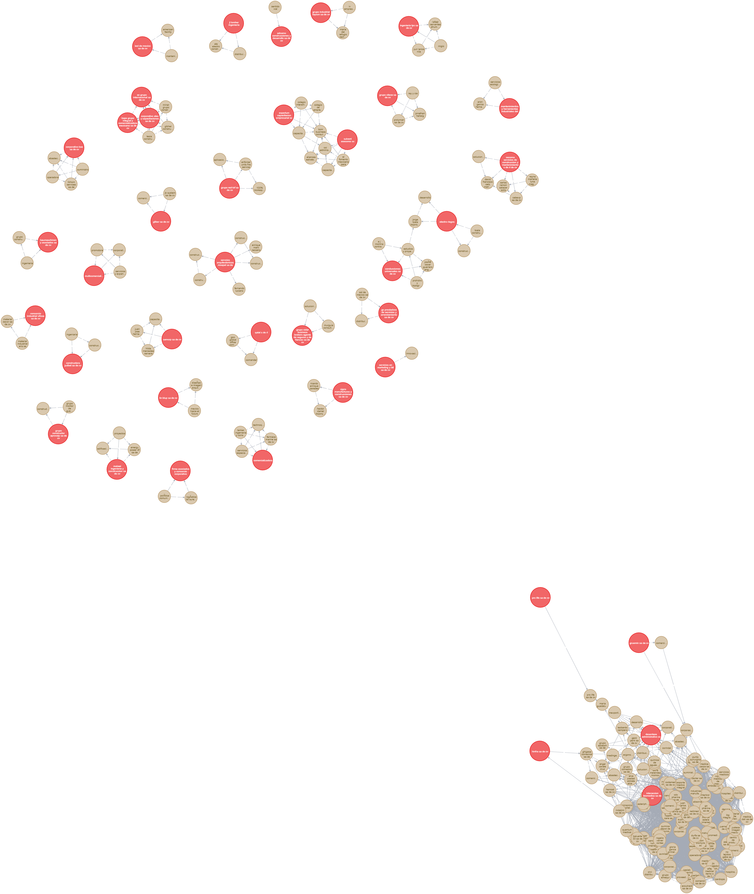

# Explorando la actividad de las empresas fantasma en la red de compras públicas
El "Datatón Anticorrupción" es un hackathon donde construimos herramientas informativas para la sociedad utilizando datos abiertos proporcionados por el Sistema Nacional Anticorrupción (SNA). 

Objetivo específico: estudiar el comportamiento de empresas fantasma en la red de compras públicas.

El siguiente modelo muestra una propuesta de grafo que contiene los nodos, relaciones y propiedades necesarios para explorar datos de contrataciones públicas abiertas.


Con datos de la lista definitiva de empresas fantasma publicada por el SAT al 4 de diciembre del 2019 (www.sat.gob.mx/cifras_sat/Paginas/datos/vinculo.html?page=ListCompleta69B.html), se procedió a asignar una nueva etiqueta de tipo EmpresaFantasma a los 97 registros de licitantes coincidentes según su RFC. La consulta de Cypher muestra la creación de la nueva etiqueta.

```
MATCH (c:Licitante)
c.rfc='ACA1406049K8' OR c.rfc='ACD1103303Z7' OR c.rfc='ACI0702232A5' OR c.rfc='ADS101126FL0' OR c.rfc='AGI1512015H0' OR
c.rfc='BAS090909A56' OR c.rfc='CAC160129NA3' OR c.rfc='CAM131007P50' OR c.rfc='CAT090731PP0' OR c.rfc='CBE1401211PA' OR
c.rfc='CBX150529BJ5' OR c.rfc='CCI010611IQ2' OR c.rfc='CCO101201DV2' OR c.rfc='CEU150403968' OR c.rfc='CFE140612L14' OR
c.rfc='CGO1303055G8' OR c.rfc='CIN150515343' OR c.rfc='CIP050715F83' OR c.rfc='CIV150212586' OR c.rfc='CJA170126QQ3' OR
c.rfc='CJU121105B24' OR c.rfc='CMA1403117V2' OR c.rfc='COC101213AK9' OR c.rfc='COM1509019N9' OR c.rfc='CPR170222L47' OR
c.rfc='CPY110413I37' OR c.rfc='CRA120813AY9' OR c.rfc='CRI121002770' OR c.rfc='CUN0302283E9' OR c.rfc='CVI1302205Q6' OR
c.rfc='DAD1108023J4' OR c.rfc='DCE0908051U8' OR c.rfc='ECE130822534' OR c.rfc='EPJ1011206R1' OR c.rfc='ERI090226MBA' OR
c.rfc='FAC130318H39' OR c.rfc='FDP160315TU4' OR c.rfc='FER1602117Y1' OR c.rfc='GAA000804KX3' OR c.rfc='GAN111207J50' OR
c.rfc='GCA110429V28' OR c.rfc='GCB1012159G7' OR c.rfc='GCC0108201V9' OR c.rfc='GCC120614SA8' OR c.rfc='GCE100319FM9' OR
c.rfc='GDE140612D98' OR c.rfc='GIT100412NH0' OR c.rfc='GLI1410014A9' OR c.rfc='GPS980316TI6' OR c.rfc='GRE111110I43' OR
c.rfc='GRU121113NV6' OR c.rfc='GVI100428IM8' OR c.rfc='HCO071112SA9' OR c.rfc='HIN131218B16' OR c.rfc='IBI120525IV9' OR
c.rfc='ICS111005K33' OR c.rfc='IIA1501287A0' OR c.rfc='IMA021105FU4' OR c.rfc='IME101213U98' OR c.rfc='ING120518NL7' OR
c.rfc='IPO120416HR1' OR c.rfc='ISS100906S80' OR c.rfc='ITP120709J3A' OR c.rfc='JLI100518F53' OR c.rfc='KGI151019BG4' OR
c.rfc='LBL1505117S1' OR c.rfc='LSP121017IF2' OR c.rfc='MAR161003RN1' OR c.rfc='MCC091121EI3' OR c.rfc='MHI170113B85' OR
c.rfc='MIC101216PV3' OR c.rfc='MII110216RHA' OR c.rfc='MPE1409032T9' OR c.rfc='NOP140123QJ5' OR c.rfc='OIN140605828' OR
c.rfc='PAG1207103F3' OR c.rfc='PCC140702N80' OR c.rfc='PLI9810084S5' OR c.rfc='QAL101119IG2' OR c.rfc='QCM130919BA4' OR
c.rfc='RAD161003M6A' OR c.rfc='RIN140207JE8' OR c.rfc='RSE151111DF3' OR c.rfc='RSF100914BJ0' OR c.rfc='SAM1401219X5' OR
c.rfc='SAM1411187K9' OR c.rfc='SAS150205MD6' OR c.rfc='SCB0711222D9' OR c.rfc='SEN100929MGA' OR c.rfc='SEP100202TP5' OR
c.rfc='SMB071126NX9' OR c.rfc='SMC971125JU6' OR c.rfc='SSC161011DS3' OR c.rfc='TAS110913GZ3' OR c.rfc='TDI120709PH7' OR
c.rfc='VAN160812IK2' OR c.rfc='ZAP161212KM9'
SET c:EmpresaFantasma
RETURN *
```

Posteriormente, se procedió a explorar el vecindario de las empresas fantasma en todos los contratos en los cuales estos licitantes fueron invitados a procesos de contratación directos o selectivos. El vecindario incluye tanto los procesos de contratación en cuestión como los otros licitantes no necesariamente catalogados como empresas fantasmas que también fueron invitados a esos procesos.
El query de Cypher que permite visualizar ese vecindario se muestra a continuación. Adicionalmente todas las empresas dentro de ese vecindario se asignaron a una nueva etiqueta llamada Vecindario para facilitar las consultas posteriores.

```
MATCH (a1:EmpresaFantasma)-[:LICITA]->(c:Contrato)<-[:LICITA]-(a2:LICITANTE)
WHERE c.método='directo' OR c.método='selectivo'
SET a1:Vecindario, a2:Vecindario
RETURN *
```



Ahora bien, si se deseara utilizar el grafo para ejecutar algoritmos de grafos (ejemplo: detección de comunidades) o para la construcción de un modelo predictivo que determine si una empresa es Fantasma o no. Un punto de partida conveniente es un grafo bipartito de contratos y licitantes como el que se muestra en la sección a) de la siguiente figura. De allí se obtiene una proyección donde las empresas que han participado juntas en algún contrato se unen a través de una relación inferida CO_LICITA con una propiedad llamada contador que contiene el número de procesos en los que esas empresas han coincidido. A partir de ahí se genera una proyección que solamente contiene nodos licitantes como se observa en la sección b) de la misma figura.





El siguiente query de Cypher crea la nueva relación CO_LICITA con el contador de contratos directos y selectivos comunes a los licitantes del vecindario Q1. Y la imagen de la proyección de licitantes se muestra más abajo.

```
MATCH (a1:Q1)-[:LICITA]->(c:Contrato)<-[:LICITA]-(a2:Q1)
WHERE (c.método='directo' OR c.método='selectivo') AND a1<>a2
WITH a1, a2, count(c) AS contador
MERGE (a1)-[colicita:CO_LICITA]-(a2)
SET colicita.contador = contador
RETURN *
```



A la proyección obtenida se le pueden aplicar múltiples algoritmos, entre ellos aquellos que tienen que ver con la detección de comunidades. Entre ellos, la modularidad de Louvain ha ddemostrado ser una alternaiva eficaz para la detección de comunidades criminales. El siguiente código de Cypher aplica modularidad de Louvain a la proyección. El resultado son grupos dde licitantes que se encuentran agrupados en función de la densidad de sus conexiones. El resultado típico se muestra a continuación. Si por ejemplo se desea estudiar el caso de alguna empresa específica, la comunidad a la que fue asignada es un buen espacio para acotar la búsqueda de evidencia.

```
CALL algo.louvain.stream('Q1', 'CO_LICITA',{ direction:
'Both', weightProperty: 'contador',
includeIntermediateCommunities: true})
YIELD nodeId, communities
MATCH (a:Q1) WHERE id(a) = nodeId
RETURN algo.getNodeById(nodeId).name AS tenderer,
communities
ORDER BY communities
```
